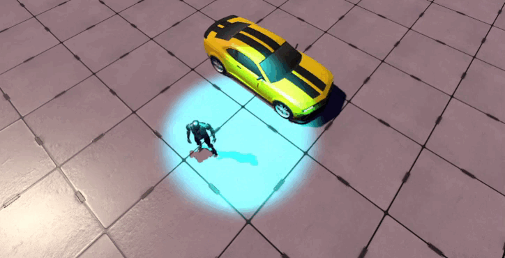

# Actividad 1

Esta primera actividad consiste en crear una escena básica en Unity y añadirle una serie de elementos:
1. GameObjects sacados del menú
  - Hemos utilizado un Objeto 3D -> Plano que actúa como suelo de nuestra escena. Además, se le ha asignado un material extraído del mismo paquete de donde se ha extraído el controlador.
2. GameObjects de la Asset Store
  - Hemos añadido a la escena un coche procedente del paquete [ARCADE: FREE Racing Car](https://assetstore.unity.com/packages/3d/vehicles/land/arcade-free-racing-car-161085).
3. Un controlador del paquete de Standard Assets o de cualquier otro paquete disponible en la Asset Store
  - Hemos extraído un controlador de tercera persona del paquete [Third Person Controller - Basic Locomotion FREE](https://assetstore.unity.com/packages/tools/game-toolkits/third-person-controller-basic-locomotion-free-82048).
4. Agregar una fuente de iluminación de un color diferente al blanco
  - Hemos usado una Luz -> Luz focal con el color cian asignado.

Este es el resultado:
