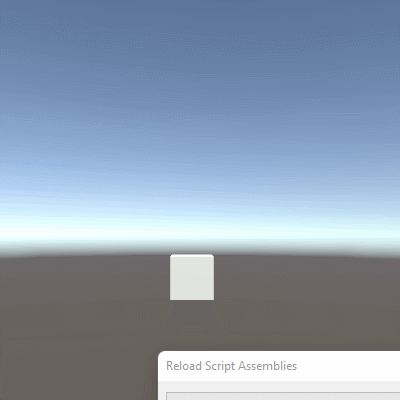
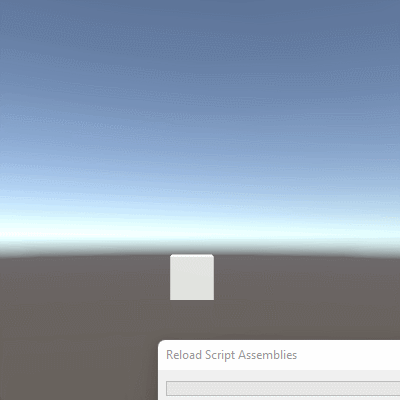

# Actividad 3

En esta tercera actividad deberemos Crear un script que mueva el objeto hacia un punto fijo que se marque como objetivo. El objetivo debe ser una variable pública, de esta forma conseguimos manipularla en el inspector y ver el efecto de distintos valores en las coordenadas:
1. Configurar la coordenada Y del Objetivo en 0
    - Poner al Objetivo una coordenada Y distinta de cero.
    - Cómo modificarías el script para que el objeto despegue del suelo y vuele como un avión
        - Como indica el objetivo, deberemos crear una variable pública *goal* de tipo *Vector3* que sea la dirección hacia la que se mueva nuestro cubo. Hecho esto, actualizaremos en *Update()* la posición del cubo para ir moviéndolo en su dirección objetivo frame a frame. Este es el código resultante:
          ```
          public class MovingCube : MonoBehaviour
          {
            public Vector3 goal;

            void Start()
            {
            }

            void Update()
            {
              transform.Translate(goal);
            }
          }
          ```
          
          Y este es el resultado con `goal=(0,1,0)`:
          
          
          
          Como podemos ver, nada más arrancar el juego, el cubo desaparece instantáneamente de la pantalla. Esto se debe a que en cada frame estamos desplazando el cubo 1 unidad hacia arriba, lo que significa que, si nuestro juego va a 60fps, estaremos moviendo el cubo 60 unidades por segundo, una barbaridad.
2. Duplicar los valores de X, Y, Z del Objetivo. ¿Es consistente el movimiento?.
    - El Objetivo no es un objetivo propiamente dicho, sino una **dirección** en la que queremos movernos.
    - La información relevante de un vector es la dirección. Los vectores normalizados, conservan la misma dirección pero su escala no afecta al movimiento. Esto se consigue con el método normalized de la clase Vector3: **this.transform.Translate(goal.normalized);**
    - Con el vector normalizado, lo podemos multiplicar por un valor de velocidad para determinar cómo de rápido va el personaje. **public float speed = 0.1f this.transform.Translate(goal.normalized*speed)**
    - A pesar de que esas velocidades puedan parecer ahora que son consistentes, no lo son, porque dependen de la velocidad a la que se produzca el update. El tiempo entre dos updates no es necesariamente siempre el mismo, con lo que se pueden tener inconsistencias en la velocidad, y a pesar de que en aplicaciones con poca complejidad no lo notemos, se debe usar: this.transform.Translate(goal.normalized * speed*Time.deltaTime); para suavizar el movimiento ya que Time.deltaTime es el tiempo que ha pasado desde el último frame.
        - Para poder ver cómo el cubo desaparece de la pantalla, usaremos un `goal=(0,0.05,0)`, lo que hará que se desplace más lentamente. Este es el resultado:
        
          
          
          Si nos fijamos, al principio el cubo va más trastabillado, lo que significa que, como el juego todavía está arrancando, va un poco congestionado, por lo que el tiempo entre frames (que es cuando actualizamos la posición del cubo) es más largo.
          Si ahora normalizamos el vector goal sin más, el cubo volverá a desplazarse a toda pastilla porque el vector goal volverá a tener una longitud de 1, por lo que necesitaremos crear una variable *speed* de tipo *float* que nos permita controlar la velocidad a la que se mueva el cubo. Hechas ambas cosas (normalizar el vector goal y usar la variable speed), tendremos el mismo resultado que hasta ahora. Este es el código resultante:
          ```
          public class MovingCube : MonoBehaviour
          {
            public Vector3 goal;
            public float speed;

            void Start()
            {
            }

            void Update()
            {
              transform.Translate(goal.normalized * speed);
            }
          }
          ```
          
          El problema de esto es que la velocidad que estamos usando es la "velocidad por frame" del cubo, es decir, la cantidad de unidades que este se va a mover en cada frame. Sin embargo, no podemos depender de los fps que tenga cada máquina ya que son completamente imprevisibles. Para pasar de "velocidad por frame" a "velocidad por segundo", que es lo que queremos, necesitaremos saber los "segundos por frame" (la invertida de los fps) y multiplicar por este valor. Como es un valor imprevisible y fluctuante a lo largo del juego, deberemos hacer en cada frame este mismo cálculo utilizando el valor que nos proporciona *Unity*: *Time.deltaTime*. Este valor corresponde a la cantidad de segundos que han transcurrido desde el frame anterior y nos ayudará a calcular la "velocidad por segundo" del cubo en el frame actual y nada más que en el frame actual. Este es el código resultante:
          
          ```
          public class MovingCube : MonoBehaviour
          {
            public Vector3 goal;
            public float speed;

            void Start()
            {
            }

            void Update()
            {
              transform.Translate(goal.normalized * speed * Time.deltaTime);
            }
          }
          ```
          
          Ahora, cuando arranquemos el juego, en vez de moverse el cubo 0.05 unidades por frame (recordemos que estábamos usando al principio un `goal=(0,0.5,0)` y luego un `goal=(0,1,0)` y `speed=0.05`), veremos que el cubo se desplazará 0.05 unidades cada segundo, por lo que irá súper despacio:
          
          
          
          Ahora, si probamos con un valor de velocidad de 1, veremos que el cubo se desplazará a una velocidad constante y consistente, a 1 unidad por segundo:
          
          
          
8. Crear una escena simple sobre la que probar diferentes configuraciones de objetos físicos en Unity. La escena debe tener un plano a modo de suelo, dos esferas y un cubo.
    - Ninguno de los objetos será físico.
    - Las esfera tiene físicas, el cubo no, pero se puede mover por el controlador en 3ª persona de los starter Assets.
    - Las esferas y el cubo tienen físicas. El cubo inicialmente está posicionado más alto que alguna de las esferas, con el mismo valor de x, z.
    - Una escena similar a la c, pero alguna esfera tiene 10 veces la masa del cubo.
    - Las esferas tienen físicas y el cubo es de tipo IsTrigger estático.
    - Las esferas tienen físicas, el cubo es de tipo IsTrigger y cinemático.
    - Las esferas tienen físicas, el cubo es de tipo IsTrigger y mecánico.
    - Una esfera y el cubo son físicos y la esfera tiene 10 veces la masa del cubo, se impide la rotación del cubo sobre el plano XZ.
