# Actividad 5

En esta actividad realizaremos una introducción al 2D en Unity.

Los ejercicios a resolver son los siguientes:

1. Importar los assets de Zombies y Goblin proporcionados.
2. Crear un script con el que mover al personaje de Zombie con salto.

Movemos a la escena un sprite de Zombie, lo que creará un GameObject con ese sprite. Le añadimos un componente Animator, un BoxCollider2D y uno RigidBody2D que vamos a necesitar. A continuación, creamos el siguiente script *PlayerController*:

```
public class PlayerController : MonoBehaviour
{
    public float MovementSpeed = 3.0f;
    public float JumpForce = 300.0f;

    private SpriteRenderer _spriteRenderer;
    private Animator _animator;
    private Rigidbody2D _rigidbody2D;
    
    public bool CanJump = true;
    
    void Start()
    {
      _spriteRenderer = gameObject.GetComponent<SpriteRenderer>();
      _animator = gameObject.GetComponent<Animator>();
      _rigidbody2D = gameObject.GetComponent<Rigidbody2D>();
    }

    void Update()
    {
        float HorizontalInput = Input.GetAxisRaw("Horizontal");
        
        if (Input.GetAxis("Jump") > 0.0f && CanJump)
        {
            CanJump = false;
            _rigidbody2D.AddForce(JumpForce * Vector2.up);
        }

        _animator.SetBool("IsWalking", HorizontalInput != 0);

        if (_spriteRenderer)
        {
            _spriteRenderer.flipX = HorizontalInput == 0.0f ? _spriteRenderer.flipX : HorizontalInput < 0.0f;
        }

        transform.Translate(HorizontalInput * MovementSpeed * Vector3.right * Time.deltaTime);
    }
    
    void OnCollisionEnter2D(Collision2D collision)
    {
        if (collision.gameObject.tag == "Floor")
        {
            CanJump = true;
        }
    }
}
```

Nada más empezar, buscamos y nos guardamos los componentes mencionados ya que los vamos a necesitar. En el Update cogemos el input del eje horizontal, actualizamos la variable *IsWalking* del Animator para que sepa cuándo debe transicionar entre los estados *Idle* y *Walking*, actualizamos el valor *flipX* del SpriteRenderer para que siempre mire hacia donde camina, trasladamos al personaje como veníamos haciendo en actividades anteriores y, finalmente, si detectamos algún input en el axis *Jump* y el personaje puede saltar (porque tiene los pies en el suelo), hacemos que salte. Es importante actualizar esta variable tanto en el momento de saltar como en el momento en el que colisionamos con un objeto que tenga el tag *Floor*, para saber cuándo el personaje está saltando y cuándo no y, por lo tanto, saber cuándo puede saltar.

3. A partir de los sprites proporcionados, crear animaciones para el Zombie. Agregar un sprite zombie, con un collider2D, y crear un script, en el que el zombie, al colisionar con él cambie la animación a Dead.

Con los sprites de caminar, creamos una animación de caminar. Con los sprites de idle, lo mismo. Además, necesitaremos crear un AnimatorController. Este tendrá un parámetro booleano *IsWalking*, dos estados *Idle* y *Walking* y dos transiciones de un estado al otro que se lanzarán en el momento en que la variable IsWalking cambie su valor. Es importante en este punto establecer el *HasExitTime* de las transiciones a false, así como el Offset y la Duration de las transiciones a 0 para que funcione correctamente.

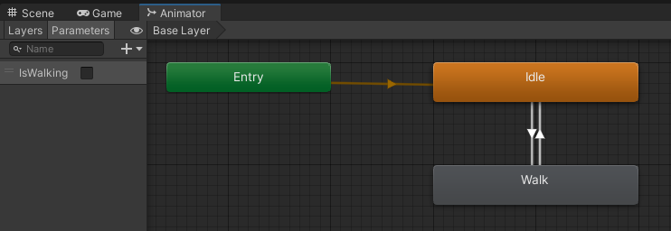

Para el segundo zombie que deberá morir al tocarlo, deberemos crear un AnimatorController muy parecido al previamente mostrado, solo que cambiando el parámetro *IsWalking* por *IsDead*, el estado *Walking* por *Dead* y no añadir transición de *Dead* a *Idle* (ya que por ahora no va a poder resucitar). Una vez hecho esto, añadiremos un script *Fragile*, donde simplemente detectará alguna colisión con un GameObject de tipo *PlayerController* y, en caso afirmativo, avisará al Animator de que ya puede morirse. Es muy importante que dejemos el valor *Loop Time* a false en la animación de muerte para que no se repita en bucle.

Este es el resultado hasta ahora:


5. Pruebas con físicas 2D. Sobre la escena que has creado en los ejercicios anteriores, configura físicas 2D sobre los objetos de la siguiente forma:


   1. Ninguno de los objetos será físico.

En este caso, los dos zombies se solaparán y no se detectará colisión.

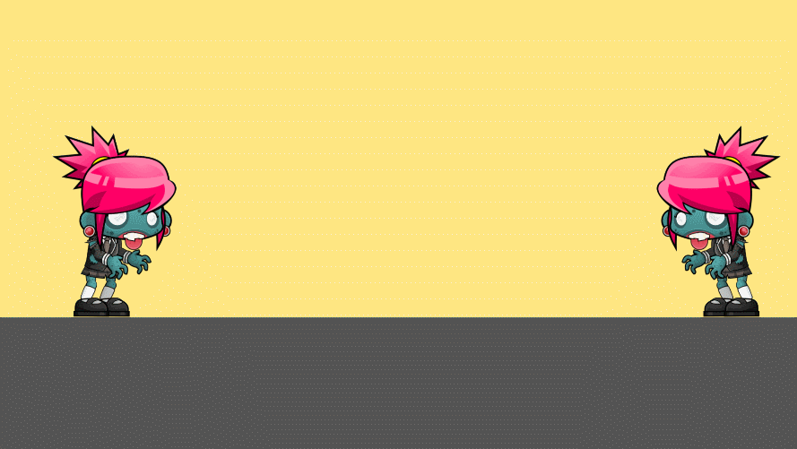

   2. Un objeto tiene físicas y el otro no.

En caso de que tenga físicas el player, colisionaremos con el otro zombie, pero no podremos empujarlo; actuará como un muro inamovible.

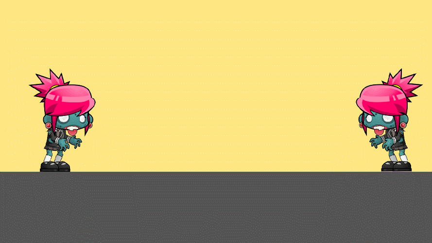

En caso de que tenga físicas el otro zombie, colisionaremos con él y además nos lo llevaremos por delante sin que este oponga resistencia.

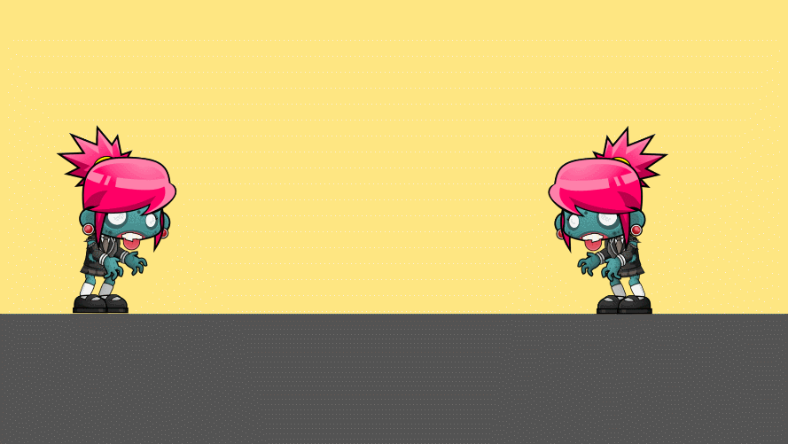

   3. Ambos objetos tienen físicas.

En este caso, colisionaremos y podremos empujar al otro zombie, pero sin llegar al punto de llevárnoslo por delante como pasaba antes.

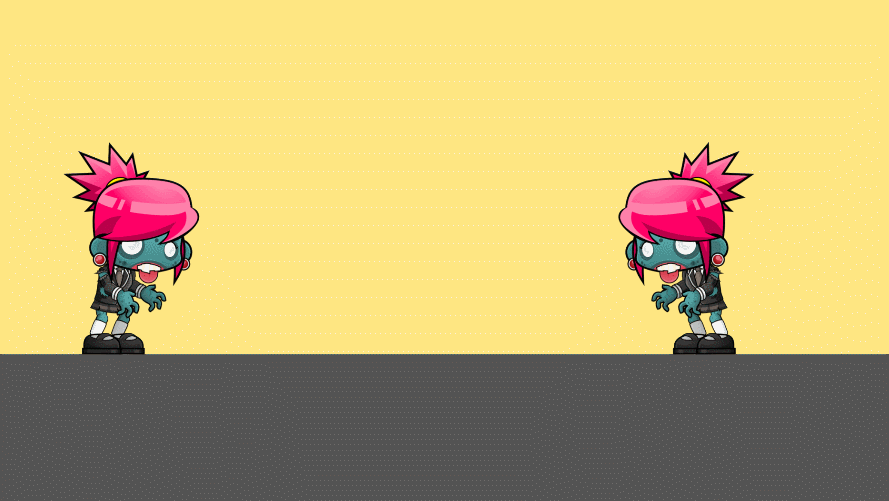

   4. Ambos objetos tienen físcas y uno de ellos tiene 10 veces más masa que el otro.

En caso de que sea el player el que tenga 10 veces la masa del otro, lo empujaremos con más potencia que antes, aunque sí que ofrecerá una pequeña resistencia.

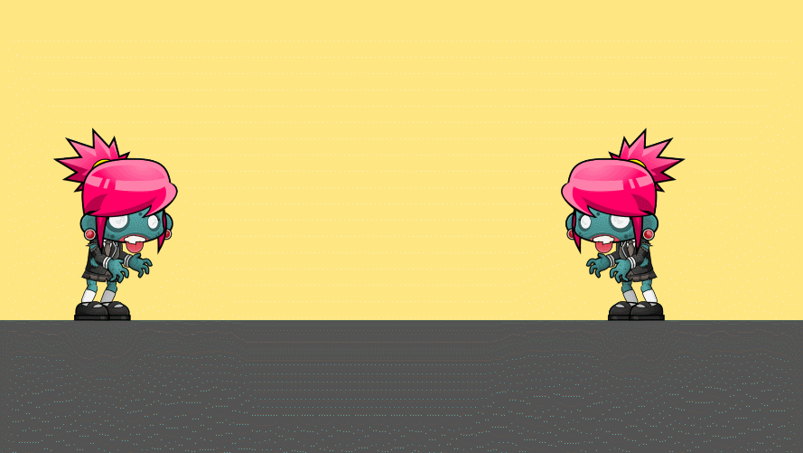

En caso de que sea el zombie que se muere el que tenga 10 veces la masa del otro, lo empujaremos débilmente, ya que ahora ofrecerá una resistencia mayor. Además, veremos que el sprite del player vibrará. Eso es porque lo estamos moviendo por código (usando el `transform.Translate` en vez de usar el motor de físicas) más distancia de la que deberíamos ya que está chocando con un obstáculo, por lo que la vibración que estamos viendo no es más que el rifirrafe entre el movimiento de nuestro código y el motor de físicas diciendo "no, ahí no puede ir, que hay un obstáculo".

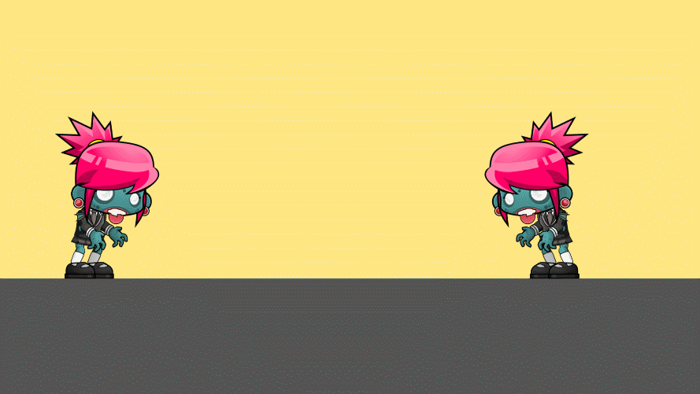

   5. Un objeto tiene físicas y el otro es IsTrigger.

En ambos casos pasará lo mismo: los dos zombies se solaparán.

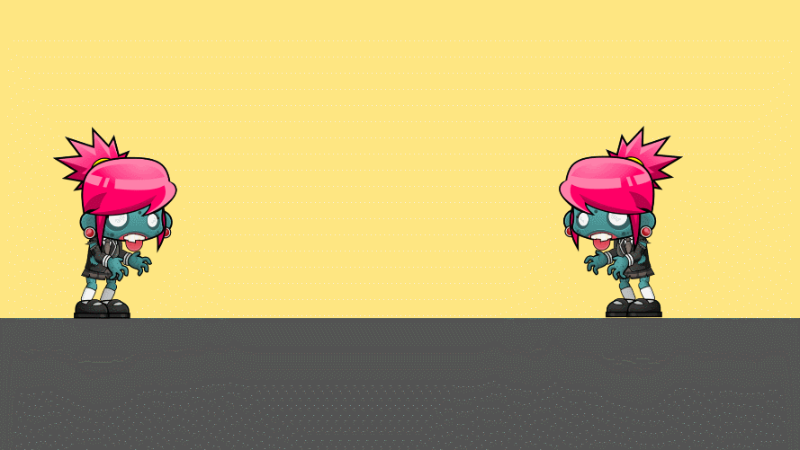

   6. Ambos objetos son físicos y uno de ellos está marcado como IsTrigger.

El zombie que sea IsTrigger dejará de ser sujeto por el suelo y caerá indefinidamente.

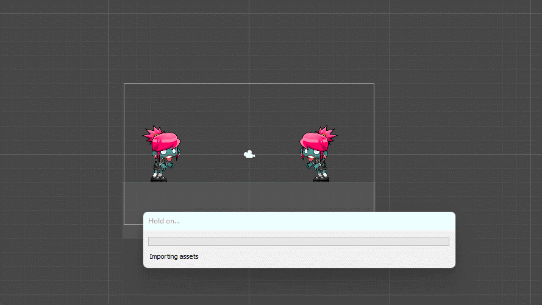

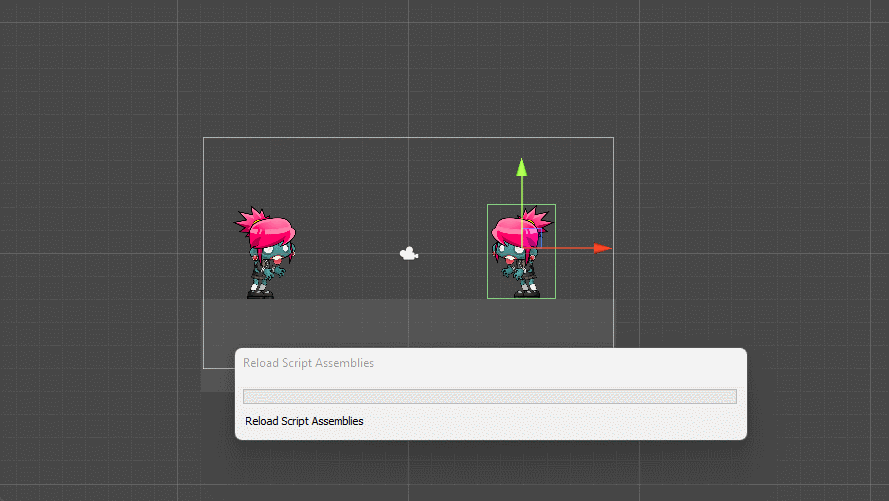

   7. Uno de los objetos es cinemático.

En caso de que sea el player el objeto cinemático, nos llevaremos por delante al otro zombie sin resistencia cuando nos choquemos con él.


En caso de que sea el zombie que se muere el objeto cinemático, este actuará nuevamente como un muro inamovible.

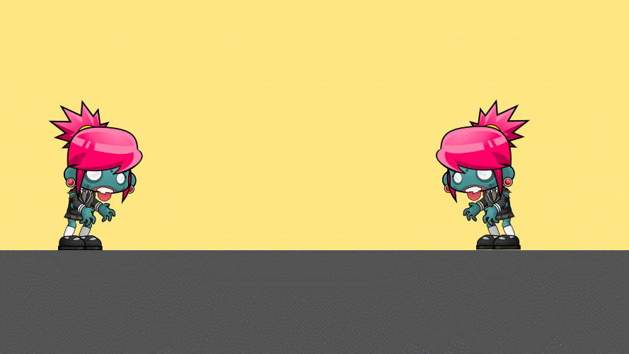