# Actividad 7

La actividad de esta semana consiste en la realización de pruebas con las herramientas de Unity para la generación de mapas de tiles. Los ejercicios a resolver son los siguientes:
1. Obtener assets que incorpores a tu proyecto para la generación del mapa: planos e isométricos.

Assets escogidos para el mapa rectangular: https://assetstore.unity.com/packages/2d/environments/free-pixel-art-kit-211149

Assets escogidos para el mapa isométrico: https://assetstore.unity.com/packages/2d/environments/cute-isometric-town-starter-pack-134286#content

(Ambos paquetes fueron proporcionados por la profesora)

2. Generar al menos 2 paletas para crear un mapa rectangular.

Para generar una paleta, hay que abrir un `Window -> 2D -> Tile Palette` y desde ahí pulsar el nombre de la paleta activa y luego en `Create New Palette` y escoger la ruta donde queremos guardarla. Tras seguir los pasos anteriores, solo hay que arrastrar un atlas o un conjunto de sprites a la paleta activa para incluirlos en esa paleta. Para las paletas isométricas, hubo que hacer muchos ajustes en los tamaños de las celdas para que los sprites isométricos encajasen en la cuadrícula y hubiese una continuidad visual al poner varios contiguos. Siguiendo este procedimiento, finalmente creamos 3 paletas para los sprites rectos y 2 para los isométricos:

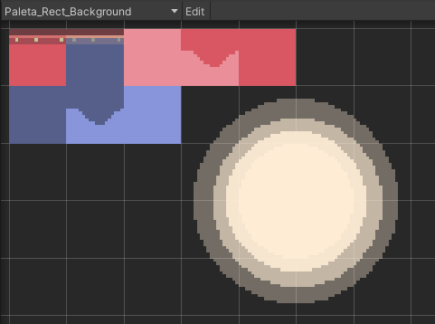

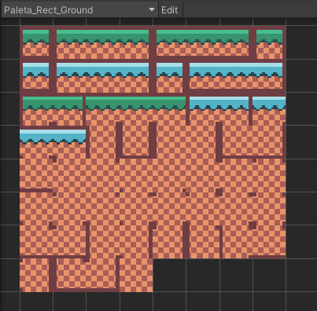

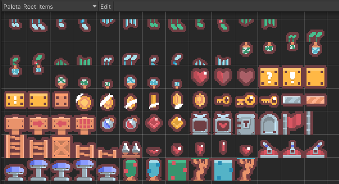

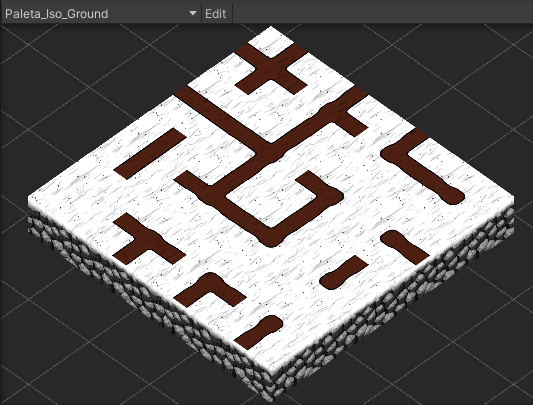


3. Crear un mapa isométrico.
4. En el mapa isométrico generar zonas elevadas y obstáculos.

Estos son los dos tilemaps creados para el mapa isométrico:

- Suelo

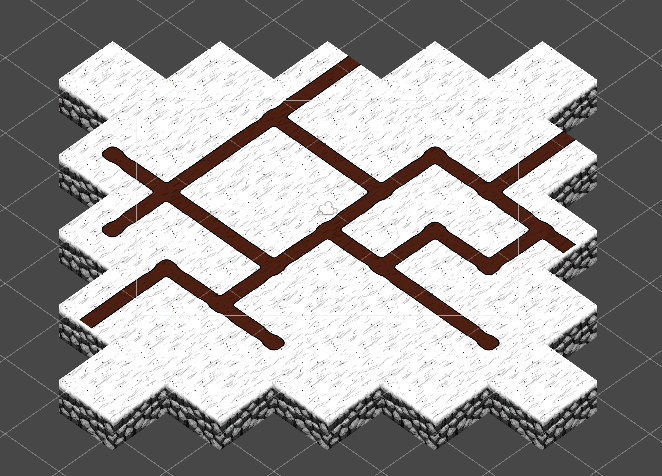

- Edificios

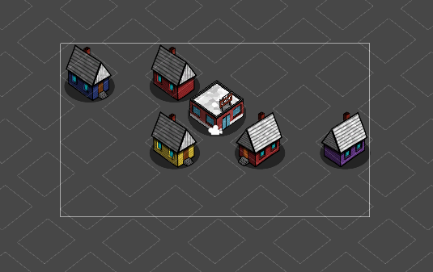

Tras realizar todos los ajustes previamente descritos y montar el mapa isométrico, este es el resultado:

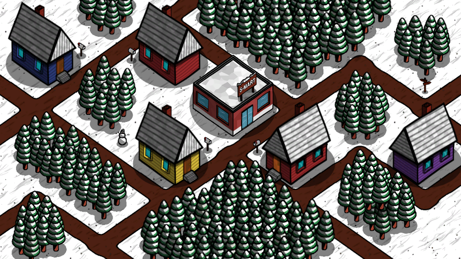

Mientras que tanto el suelo como los edificios forman parte de tilemaps, todos los árboles, buzones, un muñeco de nieve y una señal de cruce de caminos que hay son todo sprites añadidos a pelo a la escena. Como curiosidad, los tilemaps de edificios y de suelos hubo que meterlos en Grids diferentes con parámetros diferentes para poder cuadrarlos visualmente.

5. En el mapa convencional, incluir obstáculos y paredes.

Con el mapa rectangular no hubo que hacer tantos ajustes de celdas ni poner tilemaps en Grids diferentes. Finalmente, acabamos con 4 tilemaps diferentes:

- Background: Incluye el cielo.

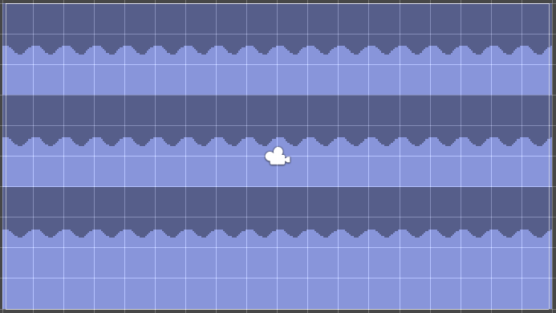

- Background 2: Incluye el sol. Es background, pero debe verse por encima del otro background, así que hubo que crear este separado del otro.

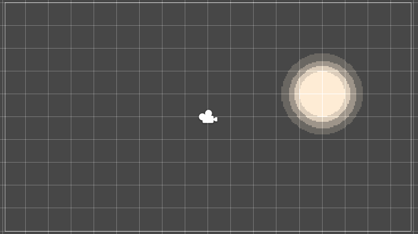

- Ground: Incluye todo lo que es suelo. Este tilemap tiene colisiones.

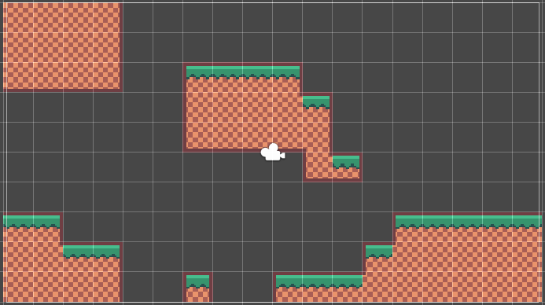

- Items: Todas las parafernalias que deba incluir nuestro mapa que no encajen con ninguno de los tilemaps anteriores, como hierba o cualquier otro objeto que no deba entrar en acción en nuestro juego.

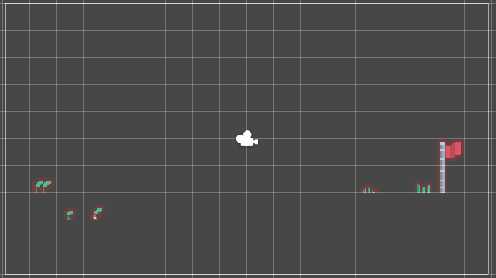


6. Seleccionar sprites para usar como decoración y sprites animados para usar como personaje y como enemigos e incorporarlos al juego.

Se usaron luces de navidad (referenciadas al final de este documento) como sprite decorativo para esta escena. Como ya trabajamos en las animaciones del jugador y del enemigo en la actividad anterior (Actividad 6), solo rescatamos esa parte de la actividad y la incorporamos en la escena.

7. Controlar mediante scripts al menos dos transiciones de animación en el personaje y una de un enemigo

Nuevamente, como ya trabajamos en las animaciones del jugador y del enemigo en la actividad anterior (Actividad 6), solo rescatamos esa parte de la actividad y la incorporamos en la escena. Como el jugador tiene animaciones para caminar y para idle, como en esta ocasión ya nos vale con que el enemigo esté idle y mientras no lo hagamos caminar se quedará siempre idle, a ambos les pondremos el AnimatorController del player de la otra actividad.

Tras realizar todo lo anteriormente descrito, este es el resultado:

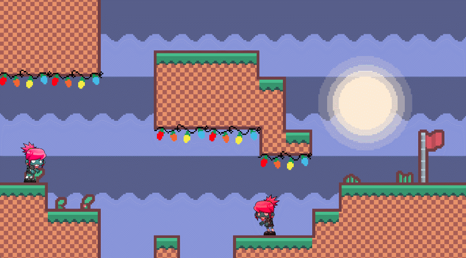

8. Incorpora elementos físicos en tu escena que respondan a las siguientes restricciones:

a) Objeto estático que ejerce de barrera infranqueable

Incorporaremos un sprite directamente a escena y le añadiremos un BoxCollider2D. En el siguiente ejemplo hemos utilizado un árbol:

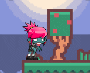

b) Zona en la que los objetos que caen en ella son impulsados hacia adelante

Para este ejercicio hemos añadido un sprite que es un cartel con una flecha derecha (para indicar que va a impulsar objetos en esta dirección) con un BoxCollider2D de tipo Trigger. Además, le hemos incorporado un script Impulse que lo que hace es impulsar a otro gameobject con el que detecte solapamiento, siempre y cuando este tenga un RigidBody2D:

```
public class Impulse : MonoBehaviour
{
    public Vector2 ImpulseDirection = Vector2.right;
    public float ImpulseForce = 100.0f;
    
    void OnTriggerEnter2D(Collider2D other)
    {
        Rigidbody2D otherRigidbody2D = other.gameObject.GetComponent<Rigidbody2D>();
        if (otherRigidbody2D)
        {
            otherRigidbody2D.AddForce(ImpulseForce * ImpulseDirection);
        }
    }
}
```

Este es el resultado:

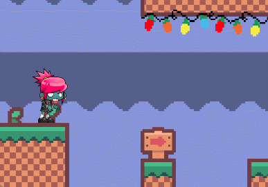

c) Objeto que es arrastrado por otro a una distancia fija

Para este ejemplo, apilaremos dos cajas con BoxCollider2d y RigidBody2D y lo normal sería que, al empujarlas, cada una se fuera por su lado:

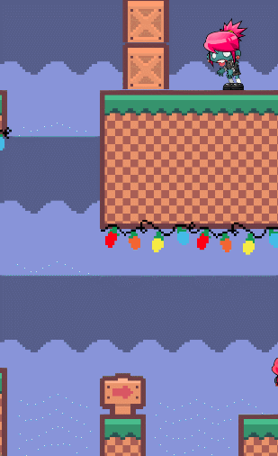

Si ahora añadimos un componente Joint2D a una de las cajas y con el mismo la conectamos con la otra caja, activando las colisiones, obtenemos el siguiente resultado:


d) Objeto que al colisionar con otros sigue un comportamiento totalmente físico.

Simplificando el ejemplo anterior, si solo tenemos una caja con BoxCollider2d y RigidBody2D esta seguirá un comportamiento físico. Hay que tener en cuenta que el BoxCollider2D no debe ser de tipo Trigger y el RigidBody2D debe ser de tipo dinámico. Este es el resultado:

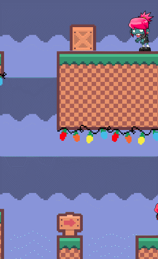

e) Incluye dos capas que asignes a diferentes tipos de objetos y que permita evitar colisiones entre ellos.

Para este ejemplo, crearemos conceptualmente dos capas: una frontal y una trasera. Los objetos pertenecientes a la capa frontal tendrán más importancia que los de la capa trasera a la hora de renderizarlos. A la práctica, utilizaremos la capa por defecto de Unity como capa trasera y solo crearemos una capa de tipo Front para todos los objetos que estén en el plano frontal de la escena. También deberemos duplicar el Tilemap Ground y añadirla a la capa frontal para que los objetos que pertenezcan a la capa frontal, como no colisionan con ningún objeto de la capa trasera, puedan mantener también los pies en el suelo y no caer infinitamente. Para crear una capa, deberemos ir a cualquier gameobject de la escena y, en la parte superior derecha del inspector, seleccionar el nombre de la capa y luego en añadir capa:

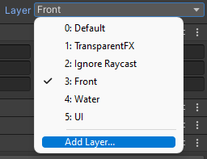

Posteriormente, en `Edit -> Project Settings -> Physics 2D` deberemos especificar que la capa Default y la Front no deben colisionar:

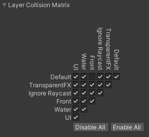

Siguiendo la línea de los ejemplos con cajas, crearemos un par de ellas, de las cuales una pertenecerá a la capa Default y la otra a la capa Front. Además, añadiremos al script de PlayerController la posibilidad de cambiar al jugador de capa mediante el uso de las teclas verticales (flecha arriba transportará a la capa de índice 0 Default y flecha abajo transportará a la capa de índice 3 Front):

```
void Update()
{
    float VerticalInput = Input.GetAxisRaw("Vertical");
    if (VerticalInput > 0.0f)
    {
        gameObject.layer = 0; // Default layer
    }
    else if (VerticalInput < 0.0f)
    {
        gameObject.layer = 3; // Front layer
    }

    [...]
}
```

Este es el resultado:

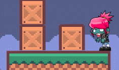

# Referencias

Sprite luces navideñas retocado con GIMP a partir de: https://www.shutterstock.com/image-vector/christmas-lights-pixel-art-isolated-on-2035497461