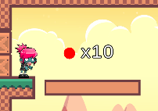

# Actividad Final: Prototipo 2D

## Introducción

El objetivo de este proyecto es la elaboración de un prototipo de juego 2D que combine todos los conceptos trabajados durante la asignatura.

## El juego

En este juego 2D de plataforma, se deberá superar una serie de obstáculos con el objetivo de alcanzar la bandera de meta:


## El escenario

El escenario se compone de una serie de tilemaps combinados entre sí, además de objetos colocados por la escena que ayudarán (o entorpecerán) al jugador a superar el nivel. Se han usado 4 tilemaps: para las paredes, los suelos, los elementos puramente visuales/decorativos y otro para las puertas que se abren al recoger la llave.

El fondo será una combinación de tres fondos de montañas, nubes y cielo que se usarán a modo de capas de parallax. Para aplicar el parallax, tendremos un objeto *Parallax* que controle del desplazamiento de sus capas dependiendo del desplazamiento del *ParallaxTarget*:

```
public class Parallax : MonoBehaviour
{
    public Renderer[] Layers;
    public float BaseSpeed = 0.0525f;

    public ParallaxTarget Target;

    void Start()
    {
        Target.OnMovement += UpdateLayers;
    }

    private void UpdateLayers(Vector3 movement)
    {
        for (int i = 0; i < Layers.Length; ++i)
        {
            Material m = Layers[i].material;
            Vector2 movement2D = new Vector2(movement.x, 0.0f);
            m.SetTextureOffset("_MainTex", m.GetTextureOffset("_MainTex") + (BaseSpeed * movement2D / (i + 1.0f)));
        }
    }
}
```

```
public class ParallaxTarget : MonoBehaviour
{
    public delegate void Movement(Vector3 dx);
    public event Movement OnMovement;
    private Vector3 _oldPosition;

    void Start()
    {
        _oldPosition = transform.position;
    }

    void Update()
    {
        Vector3 movement = transform.position - _oldPosition;
        _oldPosition = transform.position;
        if (OnMovement != null && movement.magnitude > 0.0f)
        {
            OnMovement(movement);
        }
    }
}
```

Como podemos ver, el *ParallaxTarget* irá informando a cada frame la diferencia en su posición con respecto al frame anterior a todo aquel que esté interesado, que previsiblemente será el objeto *Parallax*.

## La cámara

En este proyecto se ha utilizado Cinemachine como gestor de cámaras. Se ha colocado una cámara (que actuará como la principal) que seguirá al jugador, además de unos *CameraBounds* para la misma que abarcarán toda la escena. Además de esta cámara, se utilizará otra de la que posteriormente hablaremos.

## Las plataformas

En el nivel habrá ciertas plataformas con un movimiento autónomo que se desplazarán indefinidamente entre dos puntos (pueden ser más, pero en nuestro caso nos vale solo con dos). Estas plataformas tendrán un comportamiento *Chaser* recuperado y adaptado de otras actividades 3D de esta misma asignatura que simplemente tendrá una lista de objetivos que irá tratando de alcanzar. En cuanto alcance el objetivo actual, tratará de alcanzar el siguiente y así consecutivamente. Estas plataformas podrán ser activadas o desactivadas por agentes externos bajo ciertas condiciones.

```
public class Chaser : MonoBehaviour
{
    public Transform[] Goals;
    public float MovementSpeed = 1.0f;
    public float AcceptanceRadius = 1.0f;
    public bool IsEnabled = true;

    private int _currentGoalIdx = 0;

    void Update()
    {
        if (!IsEnabled)
        {
            return;
        }

        if (_currentGoalIdx < 0 || Goals.Length <= _currentGoalIdx)
        {
            return;
        }
        Transform currentGoal = Goals[_currentGoalIdx];
        Vector3 currentToGoal = currentGoal.position - transform.position;
        if (currentToGoal.magnitude > AcceptanceRadius)
        {
            transform.Translate(currentToGoal.normalized * MovementSpeed * Time.deltaTime);
        }
        else
        {
            _currentGoalIdx = (_currentGoalIdx + 1) % Goals.Length;
        }
    }

    public void ToggleEnabled()
    {
        IsEnabled = !IsEnabled;
    }

    public void SetEnabled(bool inIsEnabled)
    {
        IsEnabled = inIsEnabled;
    }
}
```

## Los recogibles

En la escena habrá una serie de objetos que podrán ser recogidos. Habrá de dos tipos: monedas y llaves. Recogerlos podrá desencadenar algo. Por ejemplo, hay una plataforma que requiere que el jugador recoja 10 monedas para funcionar. Además, recoger la llave nos abrirá la puerta que nos lleva hacia la meta.

El comportamiento común entre las monedas y las llaves se recogerán en el script *Pickable*. Este componente tendrá un atributo TTL (Time To Live) que defina cuánto tardará el recogible en "expirar". Este componente simplemente lo que hará es, a la par que comprueba a cada frame si ha expirado, estará pendiente de si detecta algún solapamiento con el jugador. En ambos casos, lanzará un evento OnExpired u OnPicked para quien esté interesado. El script *Coin* heredará de *Pickable* pero no añadirá lógica extra. EL script *Key*, sin embargo, tendrá un atributo *Door* y al ser recogido intentará abrirla (en nuestro caso destruyendo su gameObject):

```
public class Pickable : MonoBehaviour
{
    public float TimeToLive = 0.0f;
        
    public delegate void Picked(Pickable pickable);
    public event Picked OnPicked;
    public delegate void Expired(Pickable pickable);
    public event Expired OnExpired;

    void Update()
    {
        if (TimeToLive <= 0.0f)
        {
            return;
        }

        TimeToLive -= Time.deltaTime;
        if (TimeToLive <= 0.0f && OnExpired != null)
        {
            OnExpired(this);
        }
    }

    void OnTriggerEnter2D(Collider2D other)
    {
        if (other.gameObject.tag == "Player")
        {
            BePicked();
        }
    }

    protected virtual void BePicked()
    {
        if (OnPicked != null)
        {
            OnPicked(this);
        }
        Destroy(gameObject);
    }
}
```

```
public class Coin : Pickable
{
}
```

```
public class Key : Pickable
{
    public GameObject Door;

    protected override void BePicked()
    {
        Destroy(Door);
        base.BePicked();
    }
}
```

Como hemos comentado, hay una plataforma que requiere que el jugador recoja 10 monedas para ser activada. En la escena, nada más empezar la partida, habrá 3 monedas, así que el jugador deberá recoger 7 más. Ahí es donde entra en juego el *CoinManager*. Este componente lo que hará será instanciar nuevas monedas con el tiempo que tendrán cierto TTL. Cuando estas expiren, las ocultará y las almacenará en una *coin pool* para poder reutilizarlas en un futuro. Además, tiene un límite de monedas que puede instanciar (que en nuestro caso serán 7). En cuanto alcance este límite, si no hay monedas en la *coin pool*, no podrá instanciar más. Este es el script resultante:

```
public class CoinManager : MonoBehaviour
{
    public Object CoinPrefab;
    
    public float CoinDropRate = 1.0f;
    public float CoinDropHorizontalRange = 7.0f;
    public float CoinTTL = 7.0f;
    
    public Stack<Coin> _coinPool;
    
    public int MaxCoinsInstantiated = 7;
    private int _curCoinsInstantiated = 0;
    
    public delegate void NewCoinInstantiated(Coin coin);
    public event NewCoinInstantiated OnNewCoinInstantiated;
    
    void Start()
    {
        _coinPool = new Stack<Coin>();
        InvokeRepeating("DropCoin", CoinDropRate, CoinDropRate);
    }

    void DropCoin()
    {
        Debug.Log("Coin Pool item count: " + _coinPool.Count);
        if (_coinPool.Count == 0 && CoinPrefab != null)
        {
            if (_curCoinsInstantiated < MaxCoinsInstantiated)
            {
                Debug.Log("Coin Pool empty. Instantiating a new coin...");
                Object instCoinObject = Instantiate(CoinPrefab, GetRandomLocationForCoin(), new Quaternion());
                Coin instCoin = instCoinObject.GetComponent<Coin>();
                if (instCoin != null)
                {
                    instCoin.TimeToLive = CoinTTL;
                    instCoin.OnExpired += HideCoin;
                    if (OnNewCoinInstantiated != null)
                    {
                        OnNewCoinInstantiated(instCoin);
                    }
                }
                ++_curCoinsInstantiated;
            }
        }
        else
        {
            Debug.Log("Coin Pool not empty. Reusing a coin from the Coin Pool...");
            Coin popCoin = _coinPool.Pop();
            popCoin.TimeToLive = CoinTTL;
            popCoin.transform.position = GetRandomLocationForCoin();
            popCoin.gameObject.SetActive(true);
        }
        
    }

    void HideCoin(Pickable pickable)
    {
        Debug.Log("Coin expired. Hiding it...");
        Coin coin = pickable as Coin;
        if (coin != null)
        {
            coin.gameObject.SetActive(false);
            _coinPool.Push(coin);
        }
    }

    Vector3 GetRandomLocationForCoin()
    {
        return new Vector3
        (
            transform.position.x + Random.Range(-CoinDropHorizontalRange, CoinDropHorizontalRange),
            transform.position.y,
            transform.position.z
        );
    }
}
```

Como hemos comentado, hay una plataforma que requiere que el jugador recoja 10 monedas para ser activada. Esta plataforma, además del componente *Chaser* que ya hemos comentado, tendrá un componente *Actionable* que, al empezar la partida, se guardará una referencia al anterior. Además, buscará todas las monedas que haya en la escena y se suscribirá a su OnPicked. También, se suscribirá al evento OnNewCoinInstantiated de todos los *CoinManager* que haya en la escena, que lo único que hará será suscribirse al OnPicked de la moneda recién creada. El componente *Actionable*, al detectar que una moneda ha sido recogida, actualizará su propio contador de monedas recogidas, lo comparará con su requisito de monedas y, en caso de que se cumpla, destruirá su pista, activará la plataforma y se destruirá a sí mismo. Su pista no es más que un gameObject con una especie de pancarta informativa encima de la plataforma informando de que se requieren 10 monedas para activar la plataforma:



Este es el script *Actionable* resultante:

```
public class Actionable : MonoBehaviour
{
    public int RequiredCoins = 0;
    private int _collectedCoins = 0;
    
    private Chaser _chaser;
    public GameObject Hint;
    
    void Start()
    {
        _chaser = gameObject.GetComponent<Chaser>();
        
        Pickable[] pickables = FindObjectsOfType<Pickable>();
        foreach (Pickable pickable in pickables)
        {
            SubscribeOnPicked(pickable);
        }
        CoinManager[] coinManagers = FindObjectsOfType<CoinManager>();
        foreach (CoinManager coinManager in coinManagers)
        {
            coinManager.OnNewCoinInstantiated += SubscribeOnPicked;
        }
    }

    void Collect(Pickable pickable)
    {
        Coin coin = pickable as Coin;
        if (coin != null)
        {
            if (++_collectedCoins >= RequiredCoins)
            {
                if (Hint)
                {
                    Destroy(Hint);
                }

                _chaser.SetEnabled(true);
                Destroy(this);
            }
        }
    }

    void SubscribeOnPicked(Pickable pickable)
    {
        pickable.OnPicked += Collect;
    }
}
```

Cuando recojamos alguno de estos objetos previamente descritos, querremos que en pantalla se nos muestre información sobre cuántos de ellos hemos recogido. De esto se encargará el componente *Collecter*, que tendrá una referencia a los textos de la UI que actúen como contadores de cada tipo de coleccionable. Similarmente a como sucedía anteriormente con el *Actionable*, este componente se suscribirá a todos los OnPicked de todos los *Pickable* que encuentre por la escena, así como al OnNewCoinInstantiated de los *CoinManager*. En cuanto detecte que un coleccionable ha sido recogido, comprobará de qué tipo es y actualizará la UI:

```
public class Collecter : MonoBehaviour
{
    public TMP_Text NKeysUILabel;
    public TMP_Text NCoinsUILabel;
    
    private int KeysCollected = 0;
    private int CoinsCollected = 0;

    void Start()
    {
        Pickable[] pickables = GameObject.FindObjectsOfType<Pickable>();
        foreach (Pickable pickable in pickables)
        {
            SubscribeOnPicked(pickable);
        }
        CoinManager[] coinManagers = GameObject.FindObjectsOfType<CoinManager>();
        foreach (CoinManager coinManager in coinManagers)
        {
            coinManager.OnNewCoinInstantiated += SubscribeOnPicked;
        }
    }

    void Collect(Pickable pickable)
    {
        Key key = pickable as Key;
        if (key != null)
        {
            KeysCollected++;
            NKeysUILabel.text = "x" + KeysCollected;
            return;
        }
        Coin coin = pickable as Coin;
        if (coin != null)
        {
            CoinsCollected++;
            NCoinsUILabel.text = "x" + CoinsCollected;
            return;
        }
    }

    void SubscribeOnPicked(Pickable pickable)
    {
        pickable.OnPicked += Collect;
    }
}
```

Anteriormente hemos comentado que había una plataforma que tenía una pista de los requisitos que deben cumplirse para activados. Sucede algo parecido con la puerta tras la cual aguarda el banderín de meta. Junto a la puerta que custodia la meta se hallará un letrero:


Además, también hemos hablado de que habíamos añadido una segunda cámara de Cinemachine. Esta segunda cámara, que por defecto estará deshabilitada y con mayor prioridad que la cámara del jugador, estará apuntando a la llave. En cuanto el letrero detecte un solapamiento con el jugador, lo que hará será activar la cámara de la llave. Así, el juego informará al jugador de que si quiere cruzar esa puerta antes deberá recoger esa llave. Por supuesto, también se suscribirá al OnPicked de su llave para estar al tanto de si esta ha sido recogida y no tener que hacer esta transición de cámara informativa si la llave ya ha sido recogida y por lo tanto no es necesaria. Así es cómo se verá:


Este es el componente *KeyHint* que contendrá el letrero:

```
public class KeyHint : MonoBehaviour
{
    public CinemachineVirtualCamera _keyCamera;
    public Key _key;

    private bool _isKeyPicked = false;
    
    void Start()
    {
        _key.OnPicked += OnKeyPicked;
    }

    void OnKeyPicked(Pickable pickable)
    {
        _isKeyPicked = true;
    }

    void OnTriggerEnter2D(Collider2D collision)
    {
        if (!_isKeyPicked && collision.gameObject.tag == "Player")
        {
            _keyCamera.enabled = true;
        }
    }
    
    void OnTriggerExit2D(Collider2D collision)
    {
        if (!_isKeyPicked && collision.gameObject.tag == "Player")
        {
            _keyCamera.enabled = false;
        }
    }
}
```

## La palanca

En la escena, veremos una palanca. Esta tendrá una pista que indicará al jugador, cuando esté en rango de acción, que para accionarla deberá pulsar la tecla E. Esta palanca tendrá una lista de plataformas que deberá activar y desactivar en cuanto detecte que el jugador ha pulsado E dentro del rango de acción:

```
public class Lever : MonoBehaviour
{
    public GameObject Hint;
    public Chaser[] Platforms;
    public Sprite ActiveSprite;
    public Sprite InactiveSprite;

    private SpriteRenderer _spriteRenderer;
    private bool _isPulled = false;
    private bool _isPlayerReady = false;
    
    void Start()
    {
        _spriteRenderer = gameObject.GetComponent<SpriteRenderer>();
    }
    
    void Update()
    {
        if (_isPlayerReady && Input.GetKeyDown(KeyCode.E))
        {
            _isPulled = !_isPulled;
            _spriteRenderer.sprite = _isPulled ? ActiveSprite : InactiveSprite;
            for (int i = 0; i < Platforms.Length; ++i)
            {
                Platforms[i].ToggleEnabled();
            }
        }
    }

    void OnTriggerEnter2D(Collider2D collision)
    {
        if (collision.gameObject.tag == "Player")
        {
            _isPlayerReady = true;
            Hint.SetActive(true);
        }
    }

    void OnTriggerExit2D(Collider2D collision)
    {
        if (collision.gameObject.tag == "Player")
        {
            _isPlayerReady = false;
            Hint.SetActive(false);
        }
    }
}
```

## El jugador

El jugador tendrá un script *PlayerController* que cimplemente controlará el movimiento de derecha a izquierda del jugador, el salto, las animaciones y la orientación del sprite en función de hacia dónde esté caminando:

```
public class PlayerController : MonoBehaviour
{
    public float MovementSpeed = 3.0f;
    public float JumpForce = 500.0f;

    private SpriteRenderer _spriteRenderer;
    private Animator _animator;
    private Rigidbody2D _rigidBody2D;
    
    private bool _canJump = true;
    
    void Start()
    {
        _spriteRenderer = gameObject.GetComponent<SpriteRenderer>();
        _animator = gameObject.GetComponent<Animator>();
        _rigidBody2D = gameObject.GetComponent<Rigidbody2D>();
    }

    void Update()
    {
        float horizontalInput = Input.GetAxisRaw("Horizontal");

        // Manage animations
        if (_animator)
        {
            _animator.SetBool("IsWalking", horizontalInput != 0);
        }

        // Manage sprite orientation
        if (_spriteRenderer)
        {
            _spriteRenderer.flipX = horizontalInput == 0.0f ? _spriteRenderer.flipX : horizontalInput < 0.0f;
        }

        // Manage movement
        Vector3 movement = horizontalInput * MovementSpeed * Vector3.right * Time.deltaTime;
        transform.Translate(movement);

        // Manage jump
        if (_rigidBody2D && Mathf.Abs(_rigidBody2D.velocity.y) < 0.01f && _canJump && Input.GetAxis("Jump") > 0.0f)
        {
            _canJump = false;
            _rigidBody2D.AddForce(JumpForce * Vector2.up);
        }
    }
    
    void OnCollisionEnter2D(Collision2D collision)
    {
        if (collision.gameObject.tag == "Floor")
        {
            _canJump = true;
        }
    }
}
```

## El final de partida

El banderín de meta tendrá un componente *LevelEnd* que detectará solapamientos con el jugador. En caso de detectar uno, pausará el juego y mostrará un widget de fin de partida que nos dará la enhorabuena y nos dará las opciones de reiniciar el juego o de cerrarlo:


Este es el script *LevelEnd* resultante:

```
public class LevelEnd : MonoBehaviour
{
    public GameObject LevelEndUI;
    
    void OnTriggerEnter2D(Collider2D other)
    {
        if (other.gameObject.tag == "Player")
        {
            Time.timeScale = 0.0f;
            if (LevelEndUI != null)
            {
                LevelEndUI.SetActive(true);
            }
        }
    }
}
```

Los botones utilizarán el *GameManager* para realizar sus tareas correspondientes:

```
public class GameManager : MonoBehaviour
{
    public void PlayAgain()
    {
        SceneManager.LoadScene("Game");
        Time.timeScale = 1.0f;
    }

    public void QuitGame()
    {
        Debug.Log("Quitting game...");
        Application.Quit();
    }
}
```

## La demo

Una vez expuestos al detalle todos los entresijos que componen este prototipo de videojuego 2D, dejamos por aquí una pequeña demo a cámara rápida de cómo se resolvería el nivel actual:

